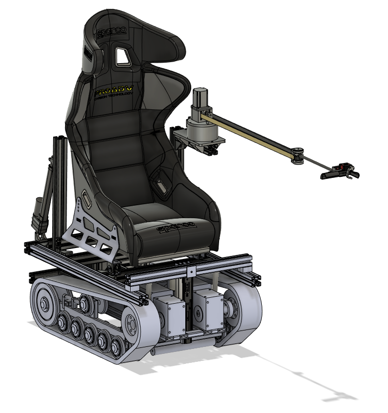
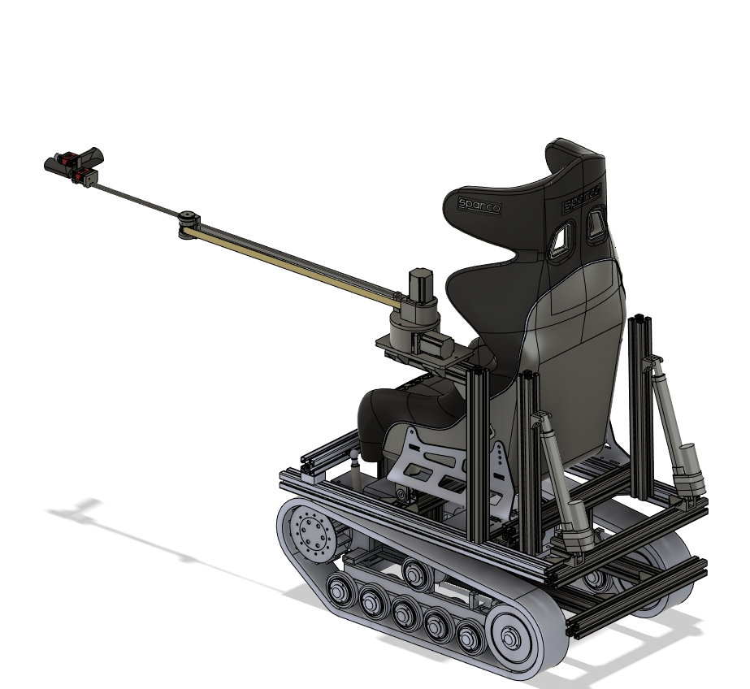
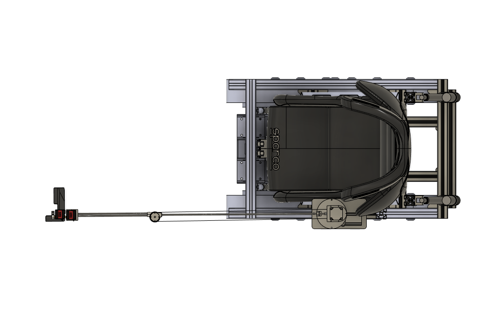
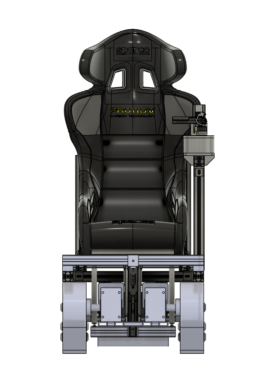
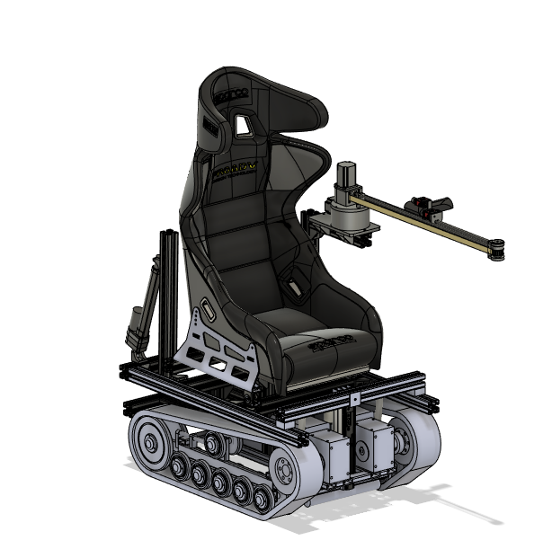

This repository contains:

- Main assembly in solidworks (Old version, newer version saved in step files made in Fusion 360)
- Step Files:
	- Arm Assembly
	- Manipulator Assembly
- Bill of materials
- STM32F303K8 microcontroller reference files
- C program for the microcontroller
- Whole Cybathlon team wheelchair assembly with mounted arm

To add:

- Kinematic analysis file
- Dynamic analysis file
- Circuit diagram
- Circuit schematic

Rendered Assembly:

Front Side

Back Side

Top

Front

Retracted Arm

